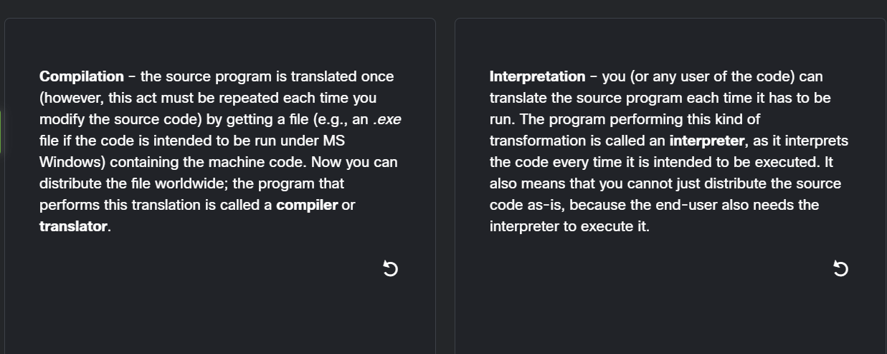
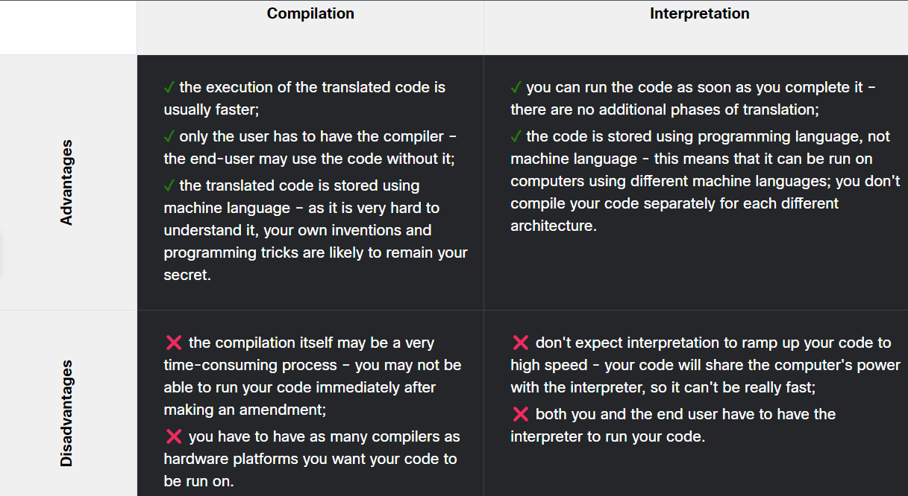
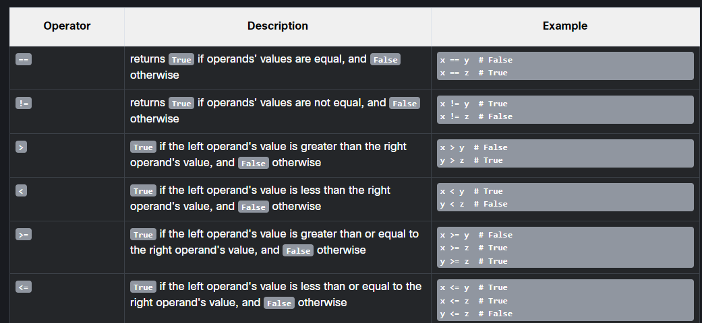

# Start with Python

**alphabetically** – a program needs to be written in a recognizable script, such as Roman, Cyrillic, etc.
**lexically** – each programming language has its dictionary and you need to master it; thankfully, it's much simpler and smaller than the dictionary of any natural language;
**syntactically** – each language has its rules and they must be obeyed;
**semantically** – the program has to make sense.





Python is an interpreted language. This means that it inherits all the described advantages and disadvantages. Of course, it adds some of its unique features to both sets.
If you want to program in Python, you'll need the Python interpreter. You won't be able to run your code without it. Fortunately, Python is free. This is one of its most important advantages.

## What is Python?

Python is a widely-used, interpreted, object-oriented, and high-level programming language with dynamic semantics, used for general-purpose programming.

And while you may know the python as a large snake, the name of the Python programming language comes from an old BBC television comedy sketch series called Monty Python's Flying Circus.

At the height of its success, the Monty Python team were performing their sketches to live audiences across the world, including at the Hollywood Bowl.

Since Monty Python is considered one of the two fundamental nutrients to a programmer (the other being pizza), Python's creator named the language in honor of the TV show.

## Despite Python's growing popularity, there are still some niches where Python is absent, or is rarely seen:

low-level programming (sometimes called "close to metal" programming): if you want to implement an extremely effective driver or graphical engine, you wouldn't use Python;
applications for mobile devices: although this territory is still waiting to be conquered by Python, it will most likely happen someday.


| Befehl | Funktion |
| ---- | ---- |
| `print("Hello, world!")` | etwas schreiben |
| `\n`| neue output linie in einem print setzten, zb; `print("The itsy bitsy spider\nclimbed up the waterspout.")` |
| `print("The itsy bitsy spider" , "climbed up" , "the waterspout.")` | mit kommas mehrere argumente nacheinander machen |
| `print("My", "name", "is", "Monty", "Python.", sep="-")` | keyword verwenden, hier im beispiel sep="-". Es wird zwischen den zeilen überall "-" ausgegeben, so wird es dann ausgegeben: My-name-is-Monty-Python. |
|`end="*"`| keyword end, wird am ende des satzes verwendet und angegeben |

### Summary

1. Literals are notations for representing some fixed values in code. Python has various types of literals - for example, a literal can be a number (numeric literals, e.g., 123), or a string (string literals, e.g., "I am a literal.").

2. The binary system is a system of numbers that employs 2 as the base. Therefore, a binary number is made up of 0s and 1s only, e.g., 1010 is 10 in decimal.

Octal and hexadecimal numeration systems, similarly, employ 8 and 16 as their bases respectively. The hexadecimal system uses the decimal numbers and six extra letters.
3. Integers (or simply ints) are one of the numerical types supported by Python. They are numbers written without a fractional component, e.g., 256, or -1 (negative integers).

4. Floating-point numbers (or simply floats) are another one of the numerical types supported by Python. They are numbers that contain (or are able to contain) a fractional component, e.g., 1.27.

5. To encode an apostrophe or a quote inside a string, you can either use the escape character, e.g., 'I\'m happy.', or open and close the string using an opposite set of symbols to the ones you wish to encode, e.g., "I'm happy." to encode an apostrophe, and 'He said "Python", not "typhoon"' to encode a (double) quote.

6. Boolean values are the two constant objects True and False used to represent truth values (in numeric contexts 1 is True, while 0 is False.

## Python Literals

You use literals to encode data and to put them into your code.

Zusammenrechnen von zahlen kann man so ausschreiben:
```bash
print(0x123)
```
Hier braucht es keine "", da der computer zahlen lesen kann.

Grösser und kleinder als verwenden: 
```bash
print(True > False)
print(True < False)
```
Die ausgabe sollte nun wie folgt aussehen:

```bash
True
False
```

What types of literals are the following four examples?

"1.5", 2.0, 528, False

The first is a string, the second is a numerical literal (a float), the third is a numerical literal (an integer), and the fourth is a boolean literal.

## Basic Python operators

| Operator | Funktion |
| -------- | -------- |
| `+` | Addiert zwei Zahlen miteinander. |
| `-` | Subtrahiert die zweite Zahl von der ersten. |
| `*` | Multipliziert zwei Zahlen miteinander. |
| `/` | Teilt die erste Zahl durch die zweite. Das Ergebnis ist immer ein Gleitkommawert (float). |
| `//` | Teilt die erste Zahl durch die zweite und gibt den größten ganzzahligen Wert zurück, der kleiner oder gleich dem Ergebnis ist (ohne Nachkommastellen). |
| `%` | Gibt den Rest der Division der ersten Zahl durch die zweite zurück. |
| `**` | Hebt die erste Zahl auf die Potenz der zweiten Zahl. |

### Summary

Key takeaways
1. An expression is a combination of values (or variables, operators, calls to functions ‒ you will learn about them soon) which evaluates to a certain value, e.g., 1 + 2.

2. Operators are special symbols or keywords which are able to operate on the values and perform (mathematical) operations, e.g., the * operator multiplies two values: x * y.

3. Arithmetic operators in Python: + (addition), - (subtraction), * (multiplication), / (classic division ‒ always returns a float), % (modulus ‒ divides left operand by right operand and returns the remainder of the operation, e.g., 5 % 2 = 1), ** (exponentiation ‒ left operand raised to the power of right operand, e.g., 2 ** 3 = 2 * 2 * 2 = 8), // (floor/integer division ‒ returns a number resulting from division, but rounded down to the nearest whole number, e.g., 3 // 2.0 = 1.0)

4. A unary operator is an operator with only one operand, e.g., -1, or +3.

5. A binary operator is an operator with two operands, e.g., 4 + 5, or 12 % 5.

6. Some operators act before others - the hierarchy of priorities:

the ** operator (exponentiation) has the highest priority;
then the unary + and - (note: a unary operator to the right of the exponentiation operator binds more strongly, for example 4 ** -1 equals 0.25)
then: *, /, and %,
and finally, the lowest priority: binary + and -.

7. Subexpressions in parentheses are always calculated first, e.g., 15 - 1 * (5 * (1 + 2)) = 0.

8. The exponentiation operator uses right-sided binding, e.g., 2 ** 2 ** 3 = 256.


## Variables

If you want to give a name to a variable, you must follow some strict rules:

the name of the variable must be composed of upper-case or lower-case letters, digits, and the character _ (underscore)
the name of the variable must begin with a letter;
the underscore character is a letter;
upper- and lower-case letters are treated as different (a little differently than in the real world – Alice and ALICE are the same first names, but in Python they are two different variable names, and consequently, two different variables);
the name of the variable must not be any of Python's reserved words (the keywords – we'll explain more about this soon).

So gibt man eine Variabel an:
```bash
var = 1
print(var)
```

1. A variable is a named location reserved to store values in the memory. A variable is created or initialized automatically when you assign a value to it for the first time. (2.1.4.1)

2. Each variable must have a unique name ‒ an identifier. A legal identifier name must be a non-empty sequence of characters, must begin with the underscore(_), or a letter, and it cannot be a Python keyword. The first character may be followed by underscores, letters, and digits. Identifiers in Python are case-sensitive.

3. Python is a dynamically-typed language, which means you don't need to declare variables in it. (2.1.4.3) To assign values to variables, you can use a simple assignment operator in the form of the equal (=) sign, i.e., var = 1.

4. You can also use compound assignment operators (shortcut operators) to modify values assigned to variables, for example: var += 1, or var /= 5 * 2.

5. You can assign new values to already existing variables using the assignment operator or one of the compound operators

## Comments

Comments can be used to leave additional information in code. They are omitted at runtime. The information left in the source code is addressed to human readers. In Python, a comment is a piece of text that begins with #. The comment extends to the end of the line.

If you want to place a comment that spans several lines, you need to place # in front of them all. Moreover, you can use a comment to mark a piece of code that is not needed at the moment (see the last line of the snippet below), for example:

```bash
# This program prints
# an introduction to the screen.
print("Hello!")  # Invoking the print() function
# print("I'm Python.")
```

### Summary

Whenever possible and justified, you should give self-commenting names to variables, e.g., if you're using two variables to store the length and width of something, the variable names length and width may be a better choice than myvar1 and myvar2.

It's important to use comments to make programs easier to understand, and to use readable and meaningful variable names in code. However, it's equally important not to use variable names that are confusing, or leave comments that contain wrong or incorrect information!

Comments can be important when you are reading your own code after some time (trust us, developers do forget what their own code does), and when others are reading your code (they can help them understand what your programs do and how they do it more quickly).

## Interaction with the user

### Commands

**input ()**

Der user soll etwas antworten, damit das Programm weiterläuft zb:

```bash 
print("Tell me anything...")
anything = input()
print("Hmm...", anything, "... Really?")
``` 

**int()**

the int() function takes one argument (e.g., a string: int(string)) and tries to convert it into an integer; if it fails, the whole program will fail too.

**float()**

the float() function takes one argument (e.g., a string: float(string)) and tries to convert it into a float (the rest is the same).

beispiel: 
```bash
leg_a = float(input("Input first leg length: "))
leg_b = float(input("Input second leg length: "))
print("Hypotenuse length is", (leg_a**2 + leg_b**2) ** .5)
```

**str()**
 You can also convert a number into a string, which is way easier and safer ‒ this kind of operation is always possible.


### Summary

1. The print() function sends data to the console, while the input() function gets data from the console.

2. The input() function comes with an optional parameter: the prompt string. It allows you to write a message before the user input, e.g.:

```bash
name = input("Enter your name: ")
print("Hello, " + name + ". Nice to meet you!")
```
 
3. When the input() function is called, the program's flow is stopped, the prompt symbol keeps blinking (it prompts the user to take action when the console is switched to input mode) until the user has entered an input and/or pressed the Enter key.

*Note*  
You can test the functionality of the input() function in its full scope locally on your machine. For resource optimization reasons, we have limited the maximum program execution time in Edube to a few seconds. Go to the Sandbox, copy-paste the above snippet, run the program, and do nothing ‒ just wait a few seconds to see what happens. Your program should be stopped automatically after a short moment. Now open IDLE, and run the same program there ‒ can you see the difference?

Tip: the above-mentioned feature of the input() function can be used to prompt the user to end a program. Look at the code below:

```bash
name = input("Enter your name: ")
print("Hello, " + name + ". Nice to meet you!")
 
print("\nPress Enter to end the program.")
input()
print("THE END.")
```
 
4. The result of the input() function is a string. You can add strings to each other using the concatenation (+) operator. Check out this code:

```bash
num_1 = input("Enter the first number: ") # Enter 12
num_2 = input("Enter the second number: ") # Enter 21
 
print(num_1 + num_2) # the program returns 1221
```
 
5. You can also multiply (* ‒ replication) strings, e.g.:

```bash
my_input = input("Enter something: ") # Example input: hello
print(my_input * 3) # Expected output: hellohellohello
```
 

## Making deciisions in Python

= is an assignment operator, e.g., a = b assigns a with the value of b;
== is the question are these values equal? so a == b compares a and b
Inequality: the not equal to operator (!=)
You can also ask a comparison question using the > (greater than) operator.

### If, else, elif

elif is used to check more than just one condition, and to stop when the first statement which is true is found.

zum Beispiel:
```bash
if the_weather_is_good:
    go_for_a_walk()
elif tickets_are_available:
    go_to_the_theater()
elif table_is_available:
    go_for_lunch()
else:
    play_chess_at_home()
```

you mustn't use else without a preceding if;
else is always the last branch of the cascade, regardless of whether you've used elif or not;
else is an optional part of the cascade, and may be omitted;
if there is an else branch in the cascade, only one of all the branches is executed;
if there is no else branch, it's possible that none of the available branches is executed.

### Summary

1. The comparison (otherwise known as relational) operators are used to compare values. The table below illustrates how the comparison operators work, assuming that x = 0, y = 1, and z = 0:



2. When you want to execute some code only if a certain condition is met, you can use a conditional statement:

- a single if statement, e.g.:

```bash
x = 10
 
if x == 10: # condition
    print("x is equal to 10")  # Executed if the condition is True.
```

- a series of if statements, e.g.:

```bash
x = 10
 
if x > 5: # condition one
    print("x is greater than 5")  # Executed if condition one is True.
 
if x < 10: # condition two
    print("x is less than 10")  # Executed if condition two is True.
 
if x == 10: # condition three
    print("x is equal to 10")  # Executed if condition three is True.
``` 
Each if statement is tested separately.

- an if-else statement, e.g.:

```bash
x = 10
 
if x < 10: # condition
    print("x is less than 10")  # Executed if the condition is True.
 
else:
    print("x is greater than or equal to 10")  # Executed if the condition is False.
```

- a series of if statements followed by an else, e.g.:

```bash
x = 10
 
if x > 5: # condition one
    print("x is greater than 5")  # Executed if condition one is True.
 
if x < 10: # condition two
    print("x is less than 10")  # Executed if condition two is True.
 
if x == 10: # condition three
     print("x is equal to 10")  # Executed if condition three is True.
``` 
Each if is tested separately. The body of else is executed if the last if is False.

- The if-elif-else statement, e.g.:

```bash
x = 10
 
if x == 10: # True
    print("x == 10")
 
if x > 15: # False
    print("x > 15")
 
elif x > 10: # False
    print("x > 10")
 
elif x > 5: # True
    print("x > 5")
 
else:
    print("else will not be executed")
``` 

If the condition for if is False, the program checks the conditions of the subsequent elif blocks - the first elif block that is True is executed. If all the conditions are False, the else block will be executed.

- Nested conditional statements, e.g.:

```bash
x = 10
 
if x > 5: # True
    if x == 6: # False
        print("nested: x == 6")
    elif x == 10: # True
        print("nested: x == 10")
    else:
        print("nested: else")
else:
    print("else")
```

## Loops

if you want to execute more than one statement inside one while loop, you must (as with if) indent all the instructions in the same way;
an instruction or set of instructions executed inside the while loop is called the loop's body;
if the condition is False (equal to zero) as early as when it is tested for the first time, the body is not executed even once (note the analogy of not having to do anything if there is nothing to do);
the body should be able to change the condition's value, because if the condition is True at the beginning, the body might run continuously to infinity – notice that doing a thing usually decreases the number of things to do).

The for loop is designed to do more complicated tasks – it can "browse" large collections of data item by item.

break – exits the loop immediately, and unconditionally ends the loop's operation; the program begins to execute the nearest instruction after the loop's body;
continue – behaves as if the program has suddenly reached the end of the body; the next turn is started and the condition expression is tested immediately.

1. There are two types of loops in Python: while and for:

the while loop executes a statement or a set of statements as long as a specified boolean condition is true, e.g.:
```bash
# Example 1
while True:
    print("Stuck in an infinite loop.")
 
# Example 2
counter = 5
while counter > 2:
    print(counter)
    counter -= 1
```
the for loop executes a set of statements many times; it's used to iterate over a sequence (e.g., a list, a dictionary, a tuple, or a set – you will learn about them soon) or other iterable objects (e.g., strings). You can use the for loop to iterate over a sequence of numbers using the built-in range function. Look at the examples below:

```bash
# Example 1
word = "Python"
for letter in word:
    print(letter, end="*")
 
# Example 2
for i in range(1, 10):
    if i % 2 == 0:
        print(i)
```

2. You can use the break and continue statements to change the flow of a loop:

You use break to exit a loop, e.g.:

```bash
text = "OpenEDG Python Institute"
for letter in text:
    if letter == "P":
        break
    print(letter, end="")
```

You use continue to skip the current iteration, and continue with the next iteration, e.g.:

```bash
text = "pyxpyxpyx
for letter in text:
    if letter == "x":
        continue
    print(letter, end="")
```

3. The while and for loops can also have an else clause in Python. The else clause executes after the loop finishes its execution as long as it has not been terminated by break, e.g.:

```bash
n = 0
 
while n != 3:
    print(n)
    n += 1
else:
    print(n, "else")
 
print()
 
for i in range(0, 3):
    print(i)
else:
    print(i, "else")
```

4. The range() function generates a sequence of numbers. It accepts integers and returns range objects. The syntax of range() looks as follows: range(start, stop, step), where:

- start is an optional parameter specifying the starting number of the sequence (0 by default)
- stop is an optional parameter specifying the end of the sequence generated (it is not included),
- and step is an optional parameter specifying the difference between the numbers in the sequence (1 by default.)

Example code:

```bash
for i in range(3):
    print(i, end=" ")  # Outputs: 0 1 2
 
for i in range(6, 1, -2):
    print(i, end=" ")  # Outputs: 6, 4, 2
```

## Logic and bit operations in Python

One logical conjunction operator in Python is the word and. It's a binary operator with a priority that is lower than the one expressed by the comparison operators.
ZB: `counter > 0 and value == 100`

 A disjunction operator is the word or. It's a binary operator with a lower priority than and (just like + compared to *).

 In addition, there's another operator that can be applied to the construction of conditions. It's a unary operator performing a logical negation. Its operation is simple: it turns truth into falsehood and falsehood into truth.

This operator is written as the word not, and its priority is very high: the same as the unary + and -.

There are four operators that allow you to manipulate single bits of data. They are called bitwise operators.

& (ampersand) ‒ bitwise conjunction;
| (bar) ‒ bitwise disjunction;
~ (tilde) ‒ bitwise negation;
^ (caret) ‒ bitwise exclusive or (xor);

### Summary

1. Python supports the following logical operators:

and → if both operands are true, the condition is true, e.g., (True and True) is True,
or → if any of the operands are true, the condition is true, e.g., (True or False) is True,
not → returns false if the result is true, and returns true if the result is false, e.g., not True is False.

2. You can use bitwise operators to manipulate single bits of data. The following sample data:

x = 15, which is 0000 1111 in binary,
y = 16, which is 0001 0000 in binary.
will be used to illustrate the meaning of bitwise operators in Python. Analyze the examples below:

& does a bitwise and, e.g., x & y = 0, which is 0000 0000 in binary,
| does a bitwise or, e.g., x | y = 31, which is 0001 1111 in binary,
˜  does a bitwise not, e.g., ˜ x = 240*, which is 1111 0000 in binary,
^ does a bitwise xor, e.g., x ^ y = 31, which is 0001 1111 in binary,
>> does a bitwise right shift, e.g., y >> 1 = 8, which is 0000 1000 in binary,
<< does a bitwise left shift, e.g., y << 3 = 128, which is 1000 0000 in binary.
* -16 (decimal from signed 2's complement) -- read more about the Two's complement operation.